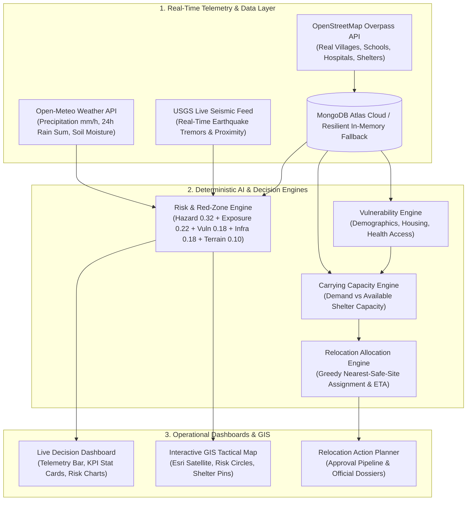

# 🌏 BhuDan — Multi-Hazard Risk & Relocation Decision Support System

> **Official Problem Statement (Smart India Hackathon 2026):**  
> *"Intelligent Identification of Hazard-Based Red Zones, Carrying Capacity Assessment, and Immediate Relocation Needs for Vulnerable Habitations"*

[]()
[]()
[]()
[]()
[]()

---

## 📖 Table of Contents
1. [Problem Statement & Background](#-problem-statement--background)
2. [Our Solution](#-our-solution)
3. [Why BhuDan Is Better](#-why-bhudan-is-better-competitive-advantages)
4. [End-to-End Operational Architecture](#-end-to-end-operational-architecture)
5. [Real-Time Live Data Ingestion](#-real-time-live-data-ingestion)
6. [The 6-Stage Analytical Decision Pipeline](#-the-6-stage-analytical-decision-pipeline)
7. [GIS Map Engine & Mechanics](#-gis-map-engine--mechanics)
8. [Dashboards & Functional Modules](#-dashboards--functional-modules)
9. [Technology Stack & Dependencies](#-technology-stack--dependencies)
10. [Database Architecture & Resilient Dual-Mode](#-database-architecture--resilient-dual-mode)
11. [Complete REST API Reference](#-complete-rest-api-reference)
12. [Installation & Quickstart Guide](#-installation--quickstart-guide)
13. [Default Role-Based Demo Accounts](#-default-role-based-demo-accounts)
14. [Testing & Verification](#-testing--verification)

---

## 🎯 Problem Statement & Background

India frequently suffers from catastrophic geomorphological and climate-induced disasters — notably the **2024 Wayanad landslide disaster**, flash floods across the Western Ghats, and Himalayan cloudbursts. During sudden disasters, District Disaster Management Authorities (DDMAs) and first responders face major operational bottlenecks:

1. **Fragmented & Stale Data**: Traditional surveillance relies on historical hazard maps or static census spreadsheets. Real-time rainfall volume, soil moisture saturation, and live seismic tremors are rarely integrated.
2. **Opaque & Uncoordinated Risk Assessment**: Risk classification is often subjective, lacking transparent mathematical formulas that explain to authorities why specific habitations are prioritized for evacuation.
3. **Shelter Carrying-Capacity Blind Spots**: Displaced citizens are frequently directed to arbitrary relief camps without verifying physical capacities, drinking water, sanitation blocks, or medical availability, causing secondary humanitarian crises.
4. **Disorganized Relocation Logistics**: First responders lack calculated road distances, transit modes (road/foot/boat), and travel ETAs to match vulnerable populations with the nearest viable safe sites.
5. **No Actionable Workflow**: Most GIS portals are purely informational and lack a structured bureaucratic workflow (proposing, reviewing, approving, executing plans) or printable executive decision dossiers.

---

## 💡 Our Solution

**BhuDan** is an end-to-end multi-hazard geospatial surveillance and relocation decision-support system built to solve the complete lifecycle of disaster response. It answers six core operational questions:

```
Where is the danger?          --> Multi-Hazard Surveillance (Landslide, Flood, Cloudburst, Seismic)
Who is vulnerable?            --> Socio-Demographic Vulnerability Engine (Infants, Elderly, Housing, Access)
How serious is the risk?      --> Transparent, Deterministic Red-Zone Scoring (0-100: GREEN, YELLOW, ORANGE, RED)
Can safe sites house them?    --> Carrying-Capacity Engine (Occupancy vs. Capacity, Deficit/Surplus)
Where should they relocate?   --> Algorithmic Nearest-Safe-Site Greedy Allocation (Distance, Mode, ETA)
Who should be prioritized?    --> Evacuation Queuing based on acute risk and past disaster recency
```

---

## 🚀 Why BhuDan Is Better (Competitive Advantages)

| Dimension | Legacy Systems & Traditional Approaches | BhuDan Platform |
| :--- | :--- | :--- |
| **Risk Modeling** | Opaque AI "black-boxes" or unweighted intuition. | **100% Transparent Mathematical Heuristics**: Direct breakdown of hazard, exposure, vulnerability, infrastructure, and terrain factors. |
| **Data Recency** | Static spreadsheets or annual census records. | **Real-Time Live Telemetry**: Live Open-Meteo rainfall, soil moisture, USGS earthquakes, and OpenStreetMap infrastructure. |
| **Capacity Auditing** | Guesswork headcounts without amenity checks. | **Automated Shelter Deficit Calculations**: Tracks water, sanitation, electricity, and medical support per facility. |
| **Evacuation Logistics**| Uncoordinated mass exodus orders. | **Nearest-Site Heuristic Matching**: Computes transit mode, travel distance (km), and arrival ETA (mins). |
| **Crisis Resilience** | System crashes if cloud database drops. | **Resilient Dual-Mode Data Layer**: Cloud MongoDB Atlas with automatic, zero-downtime in-memory fallback. |
| **Actionability** | Informational maps with no execution pipeline. | **Official 5-Stage Approval Workflow**: Propose, review, approve, execute, and export official dossiers. |

---

## 🔄 End-to-End Operational Architecture



---

## 📡 Real-Time Live Data Ingestion

The platform ingests live public telemetry with **zero API keys required** (cached in-memory for 10 minutes to prevent rate limiting):

1. **Open-Meteo Weather & Flood API**:
   - `GET https://api.open-meteo.com/v1/forecast`
   - Ingests precipitation rate (`mm/h`), 24-hour rainfall sum (`mm`), soil moisture saturation (%), and wind gusts.
   - **IMD Alert Mapping**:
     - $\ge 204.5\text{ mm}$ &rarr; **RED ALERT** (Extremely Heavy Rainfall & Flash Flood Threat)
     - $\ge 115.6\text{ mm}$ &rarr; **ORANGE ALERT** (Very Heavy Rainfall — Landslide Trigger)
     - $\ge 64.5\text{ mm}$ &rarr; **YELLOW WATCH** (Heavy Rainfall Advisory)
2. **USGS Real-Time Earthquake Hazards Program**:
   - `GET https://earthquake.usgs.gov/earthquakes/feed/v1.0/summary/all_day.geojson`
   - Ingests real-time seismic events and computes proximity via the **Haversine formula**.
3. **OpenStreetMap (OSM) Overpass API**:
   - `POST https://overpass-api.de/api/interpreter`
   - Queries real schools (`amenity=school`), hospitals (`amenity=hospital`), community centres (`amenity=community_centre`), and stadiums (`leisure=stadium`) as verified safe shelters with realistic capacities.
   - Ingests actual villages and settlements (`place=village|hamlet|town`) with genuine GPS coordinates.

---

## 🧠 The 6-Stage Analytical Decision Pipeline

1. **Multi-Hazard Detection**: Monitors exposure to landslides, flash floods, cloudbursts, earthquakes, and coastal erosion.
2. **Dynamic Risk Score (0–100)**:
   $$\text{Risk Score} = 10 \times \left(0.32 \cdot H + 0.22 \cdot E + 0.18 \cdot V + 0.18 \cdot I + 0.10 \cdot T\right)$$
   *(where $H$=Composite Hazard with Live Weather Boost, $E$=Population Exposure, $V$=Vulnerability, $I$=Infrastructure Deficit, $T$=Terrain Factor).*
3. **Red-Zone Zonation**:
   - `GREEN` (0–29): Low Risk
   - `YELLOW` (30–54): Moderate Risk
   - `ORANGE` (55–69): High Risk
   - `RED` (70–100): Critical Danger / Immediate Evacuation Required
4. **Vulnerability Assessment**: Socio-demographic share of elderly and children, building durability, road access, and distance to emergency healthcare.
5. **Carrying Capacity Assessment**: Audits shelter readiness (potable water, sanitation, backup electricity, medical stations) and checks if safe space $\ge$ demand.
6. **Relocation & Greedy Nearest-Site Allocation**: Evaluates candidates by distance and road accessibility, assigning populations to the nearest safe site with available beds and computing transit modes and ETAs.

---

## 🗺️ GIS Map Engine & Mechanics

Located at `client/src/components/map/RiskMap.jsx`:
- **Multi-Basemap GIS Tile Switching**:
  - **Satellite Hybrid**: Esri World Imagery with road and place label overlays.
  - **Street GIS**: Esri World Street Map for logistics and transport corridors.
  - **Topographic Terrain**: USGS/NOAA contour lines and elevation gradients.
  - **Dark Ops**: CartoDB dark basemap for tactical night monitoring.
- **Custom Teardrop Risk Pins**: Color-coded SVG markers (`RED`, `ORANGE`, `YELLOW`, `GREEN`) displaying embedded numerical risk scores.
- **Safe Site Shelter Pins**: Emerald tent markers indicating available capacity and current occupancy.
- **Geospatial Risk Buffer Perimeters**: Semi-transparent circular hazard perimeters scaled by acute hazard severity and slope (600m–1500m).
- **Interactive Controls**: Smooth `flyTo()` animations, deep-dive popups, and layer toggles for risk circles, shelters, pins, and district borders.

---

## 📊 Dashboards & Functional Modules

1. **Decision-Support Dashboard (`/`)**:
   - Nationwide State & District selector (covering all 36 Indian States and Union Territories).
   - Live Weather Telemetry bar (rainfall mm/h, 24h sum, soil saturation %, IMD alert badge).
   - 6 KPI stat cards (Habitations, Red Zones, Exposed Population, Vulnerable Population, Shelter Capacity, Capacity Gap).
   - Recharts visual analytics (Risk distribution bar chart & Vulnerability donut chart).
   - Red-Zone Risk Register table & **"⚡ Sync Live"** button.
2. **Real-World GIS Risk Map (`/map`)**: Full-screen tactical GIS view with basemap switching and quick-access zone dossiers.
3. **Red Zones Register (`/red-zones`)**: Focused console for high-risk zones (`RED` & `ORANGE`) requiring immediate intervention.
4. **Habitations Management (`/habitations`)**: Full CRUD registry for authorized analysts to manage settlements, slopes, and hazard records.
5. **Safe Sites & Shelters (`/sites`)**: Shelter inventory tracking capacity, occupancies, and life-support amenities.
6. **Carrying Capacity Assessment (`/capacity`)**: Evaluates district-wide shelter demand vs capacity, surfacing instant deficit warnings.
7. **Relocation Action Planner (`/relocation`)**:
   - 1-click deterministic plan generator with distance (km) and travel ETA (mins).
   - 5-stage approval workflow (`proposed` &rarr; `under_review` &rarr; `approved` &rarr; `executing` &rarr; `rejected`).
8. **Executive Decision Reports (`/reports`)**: One-click official PDF decision dossiers for District Collectors and Disaster Authorities.
9. **User Administration (`/admin`)**: Role-Based Access Control (RBAC) management.

---

## 💻 Technology Stack & Dependencies

### Backend (`server/package.json`)
- `express` (^4.19.2) — Web server & REST API framework
- `mongoose` (^8.4.0) — Object Data Modeling for MongoDB Atlas
- `bcryptjs` (^2.4.3) — Salted password hashing
- `jsonwebtoken` (^9.0.2) — Stateless authentication with JWT Bearer tokens
- `cors` (^2.8.5) — Cross-Origin Resource Sharing
- `dotenv` (^16.4.5) — Environment variables management
- `nodemon` (^3.1.0) — Hot-reloading development server

### Frontend (`client/package.json`)
- `react` (^18.3.1) & `react-dom` — Component rendering
- `react-router-dom` (^6.23.1) — Client-side SPA routing
- `leaflet` (^1.9.4) & `react-leaflet` (^4.2.1) — Interactive GIS maps
- `recharts` (^2.12.7) — Declarative charting & analytics
- `axios` (^1.7.2) — Promise-based HTTP client with Bearer token interceptors
- `vite` (^5.4.21) — Modern build tool & dev server
- `tailwindcss` (^3.4.3) — Utility-first responsive styling

---

## 🗄️ Database Architecture & Resilient Dual-Mode

The backend features a **resilient dual-mode data layer** ([`server/dataAccess.js`](file:///f:/rohan/SIH%202k26/test/server/dataAccess.js)):
- **MongoDB Atlas Cloud (Primary)**: When `MONGO_URI` is configured in `server/.env`, queries route to MongoDB Atlas using Mongoose models (`User`, `Habitation`, `SafeSite`, `Relocation`).
- **In-Memory Fallback (Offline Mode)**: If `MONGO_URI` is missing or connectivity fails during a disaster, queries automatically route to a built-in in-memory store. **The platform never crashes or goes offline.**

---

## 🔌 Complete REST API Reference

### Authentication & Users
| Method | Endpoint | Access | Description |
| :--- | :--- | :--- | :--- |
| `POST` | `/api/auth/login` | Public | Authenticate user & return JWT token |
| `POST` | `/api/auth/register` | Public | Register new Viewer / Field Officer account |
| `GET` | `/api/auth/me` | Authenticated | Retrieve authenticated user profile & role |
| `GET` | `/api/auth/demo` | Public | Retrieve pre-seeded demo credentials |
| `GET` | `/api/users` | Admin | List all registered system users |
| `POST` | `/api/users` | Admin | Create user with explicit RBAC role |
| `PATCH`| `/api/users/:id` | Admin | Update user permissions, role, or district |
| `DELETE`| `/api/users/:id`| Admin | Remove system user |

### Live Telemetry
| Method | Endpoint | Access | Description |
| :--- | :--- | :--- | :--- |
| `GET` | `/api/live/weather?district=Wayanad` | Public | Live temperature, precipitation rate, 24h rain, soil moisture, and IMD alert |
| `GET` | `/api/live/seismic?radiusKm=1500` | Public | Real-time USGS earthquake events in regional proximity |
| `GET` | `/api/live/alerts` | Public | Active natural hazard warning bulletins |
| `POST`| `/api/live/sync` | Analyst+ | Trigger on-demand OSM habitation and safe site ingestion into MongoDB |
| `GET` | `/api/live/status` | Public | Real-time health and ping latency for external APIs |

### Decision Support & Analysis
| Method | Endpoint | Access | Description |
| :--- | :--- | :--- | :--- |
| `GET` | `/api/analysis/district?district=Wayanad` | Authenticated | Full decision pipeline with live weather telemetry |
| `GET` | `/api/analysis/red-zones?district=Wayanad`| Authenticated | High and critical risk habitations (`RED` & `ORANGE`) |
| `GET` | `/api/analysis/capacity?district=Wayanad` | Authenticated | Carrying capacity analysis & surplus/deficit metrics |
| `GET` | `/api/analysis/relocation?district=Wayanad`| Authenticated | Ranked evacuation priority queue with nearest shelter ETAs |
| `GET` | `/api/analysis/districts` | Authenticated | Nationwide directory of 100+ Indian districts with live coordinates |
| `GET` | `/api/analysis/meta` | Public | Dynamic live stats (monitored population, shelter capacity) |

### Habitations & Safe Sites CRUD
| Method | Endpoint | Access | Description |
| :--- | :--- | :--- | :--- |
| `GET` | `/api/habitations?district=Wayanad` | Authenticated | List habitations |
| `POST`| `/api/habitations` | Analyst+ | Create new vulnerable habitation record |
| `PUT` | `/api/habitations/:id` | Analyst+ | Update habitation demographics / hazards |
| `DELETE`| `/api/habitations/:id` | Analyst+ | Remove habitation record |
| `GET` | `/api/sites?district=Wayanad` | Authenticated | List designated safe relief shelters |
| `POST`| `/api/sites` | Analyst+ | Add safe relief shelter |
| `PUT` | `/api/sites/:id` | Analyst+ | Update shelter capacity / amenities |
| `DELETE`| `/api/sites/:id` | Analyst+ | Delete safe site record |

### Relocation Action Plans
| Method | Endpoint | Access | Description |
| :--- | :--- | :--- | :--- |
| `GET` | `/api/relocation?district=Wayanad` | Authenticated | List persisted relocation plans |
| `POST`| `/api/relocation/generate` | Analyst+ | Generate relocation plan array with distances and ETAs |
| `PATCH`| `/api/relocation/:id/status` | Disaster Authority+ | Update status: `proposed`, `under_review`, `approved`, `executing`, `rejected` |
| `DELETE`| `/api/relocation/:id` | Analyst+ | Delete relocation plan |

---

## ⚙️ Installation & Quickstart Guide

### Prerequisites
- Node.js (v18 or higher; tested on v24)
- npm (v9 or higher)

### Setup Instructions

```bash
# 1. Clone repository
git clone https://github.com/rohanrathod45/Bhudan.git
cd Bhudan

# 2. Install dependencies for all workspaces
npm run install:all

# 3. Start Backend Server (runs on http://localhost:5000)
npm run dev:server

# 4. Start Frontend Application (runs on http://localhost:5173)
npm run dev:client
```

*Alternatively, run both concurrently from the root directory:*
```bash
npm run dev
```

---

## 🔑 Default Role-Based Demo Accounts

| Role | Email | Password | Access Privileges |
| :--- | :--- | :--- | :--- |
| **Admin** | `admin@bhudan.gov.in` | `Admin@12345` | Full system access & user administration |
| **Disaster Authority** | `collector@bhudan.gov.in` | `Disaster@12345` | Final approval for relocation plans & orders |
| **Analyst** | `analyst@bhudan.gov.in` | `Analyst@12345` | Generate plans, edit settlements, live data sync |
| **Field Officer** | `field@bhudan.gov.in` | `Field@12345` | Field survey reporting & local inspections |
| **Viewer** | `viewer@bhudan.gov.in` | `Viewer@12345` | Read-only access to maps and public dashboards |

---

## 🧪 Testing & Verification

The test suite validates deterministic scoring, capacity deficits, allocation algorithms, and live weather ingestion:

```bash
cd server
npm test
```

**Test Output:**
```text
✔ Risk Engine computes scores and classifications accurately
✔ Capacity Engine evaluates safe-site capacity and district deficit/surplus
✔ Relocation Engine allocates habitations to nearest safe sites with ETAs
✔ Dynamic Hazards Engine aggregates live habitations exposure data
✔ Live Data Service fetches weather telemetry with rainfall and IMD alerts
✔ Live Data Service fetches USGS seismic events
✔ Live Data Service provides active disaster and weather warning feeds
✔ Risk Engine dynamically increases hazard and risk score under heavy live rainfall
ℹ tests 8, pass 8, fail 0
```

---

## 📄 License & Attribution
Developed for the **Smart India Hackathon (SIH 2026)**.
- Meteorological Telemetry provided by [Open-Meteo](https://open-meteo.com/).
- Seismic Telemetry provided by [USGS Earthquake Hazards Program](https://earthquake.usgs.gov/).
- Geospatial Infrastructure provided by [OpenStreetMap contributors](https://www.openstreetmap.org/).